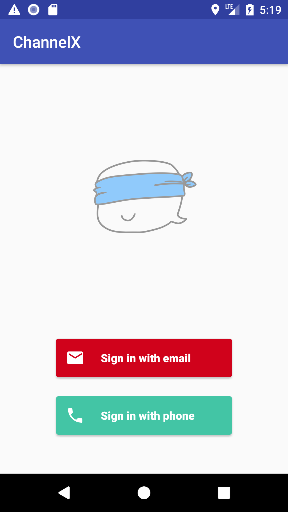
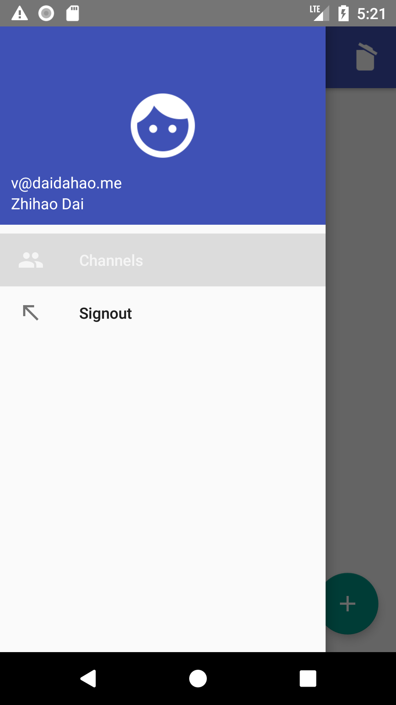
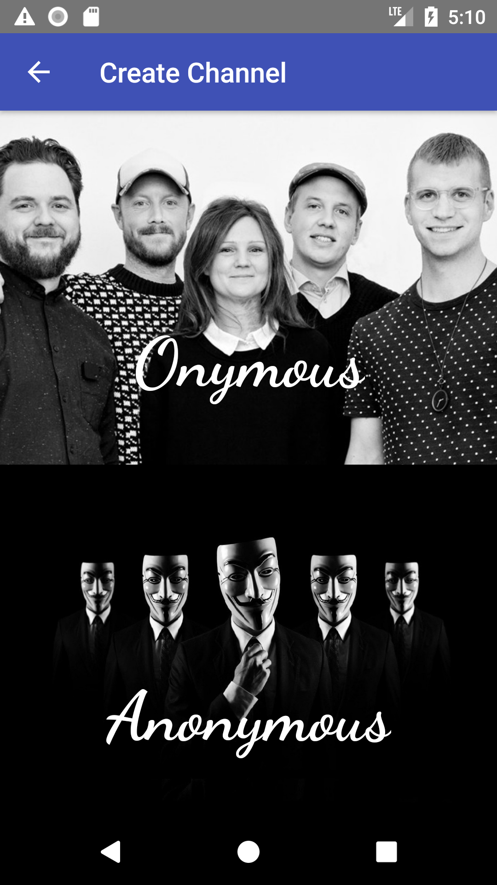
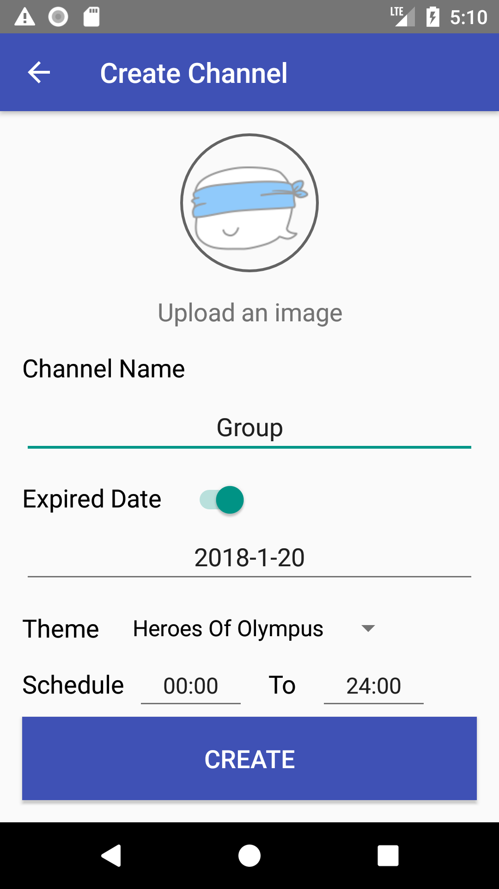
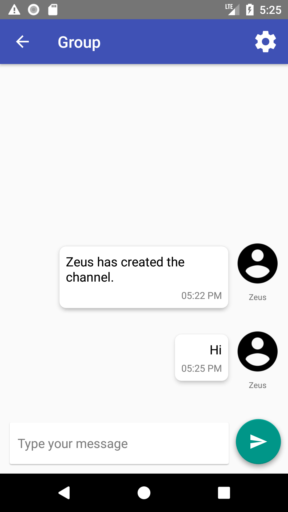
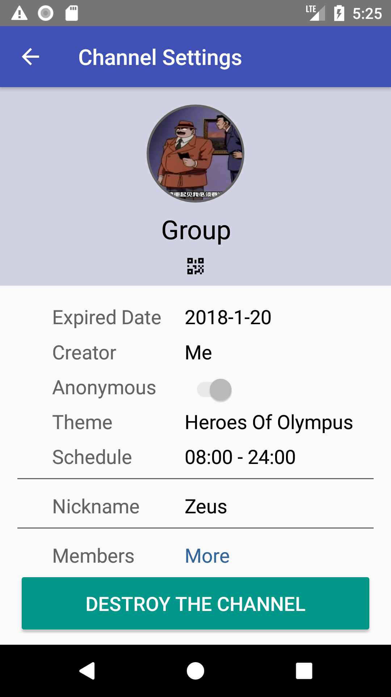
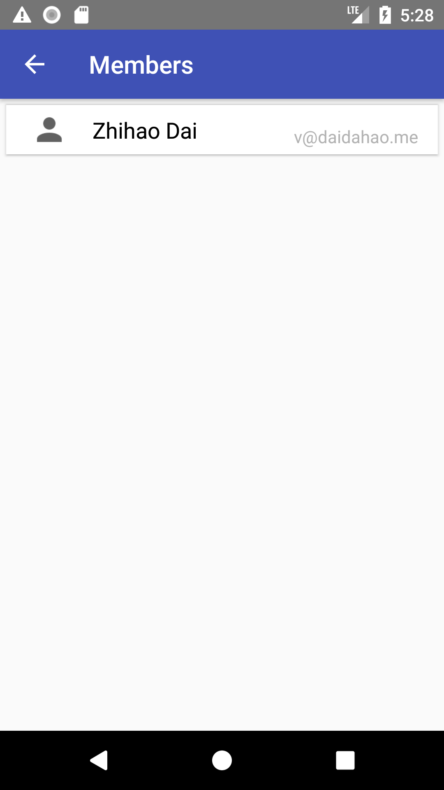

# ChannelX

A transient, anonymous channel-based instant communication application running on Android.

## Requirements

To run `ChannelX`, you need an Android device running Android 4.4 higher and Google services 11.8.0 or higher.

Specifically, if you want to use `ChannelX` in China, as `ChannelX` is heavily dependent on `Google Firebase` services, you may need to set up an VPN connection on your phone to avoid network errors.

## Features

`ChannelX` provide the following features, in contrast to traditional instant messaging apps.

### Managing User Profile

1. Sign up with Email or Phone

2. Change Profile Photo

3. Sign Out

### IM based on Channels

1. Create a Onymous / Anonymous Channel

2. Create a Transient / Permanent Channel
3. Create a Channel with Schedule

4. Join and Share a Channel via QR code

Click the "Scan"  icon at the right-top of the `MainActivity`.

Click the QR Code icon  in the Group Settings to share the QR code of the channel.

5. Send Texts through a Channel

6. Show Group Settings

7. Show Members List of a Channel

8. Leave or Destroy a Channel

Click "LEAVE THE CHANNEL" or "DESTROY THE CHANNEL" in the Group Settings to leave or destroy the channel.

